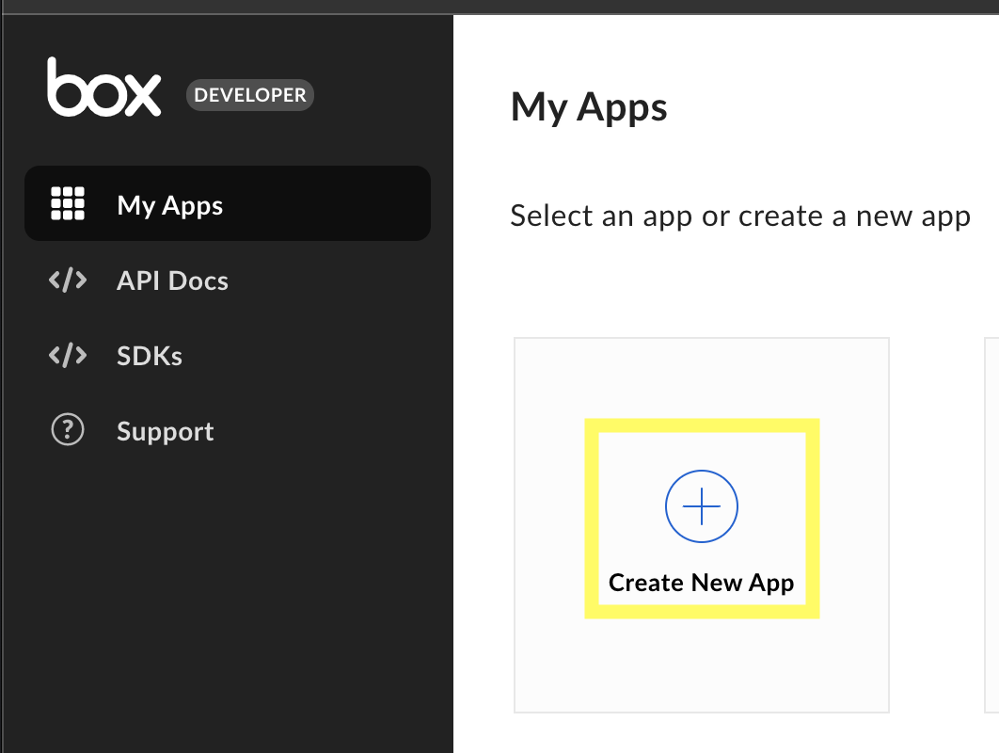
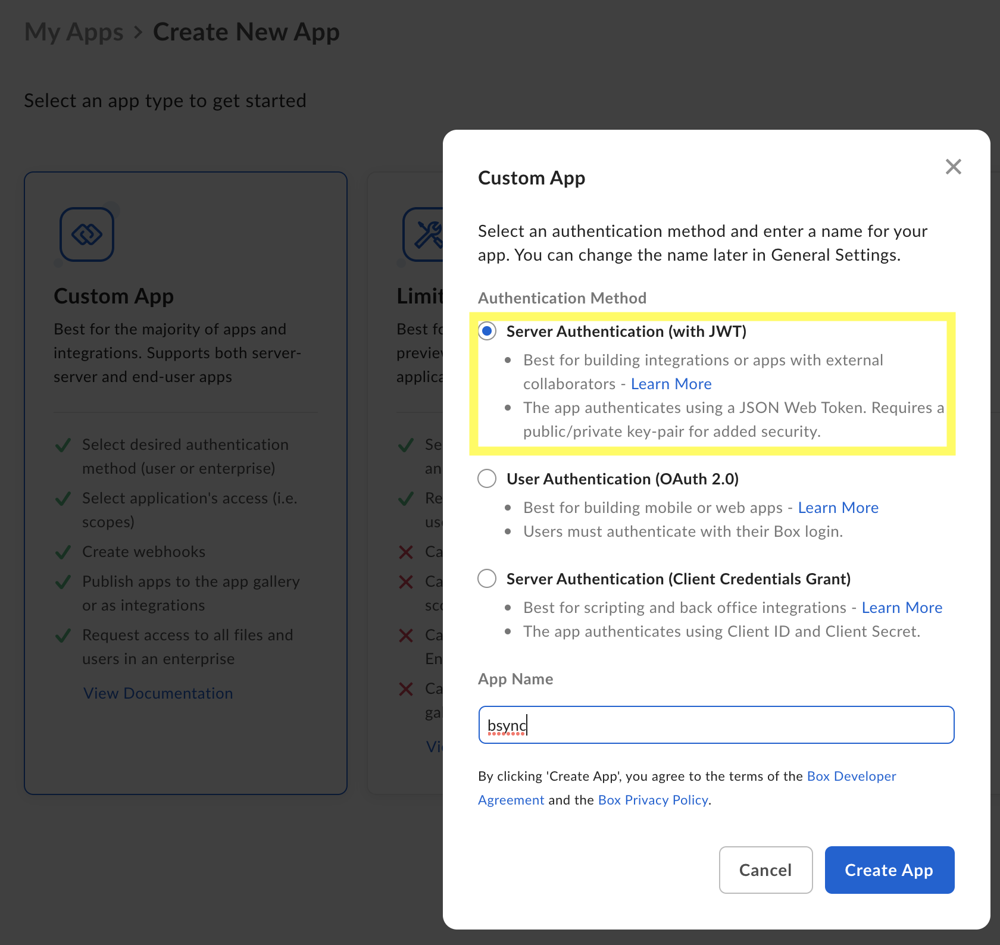
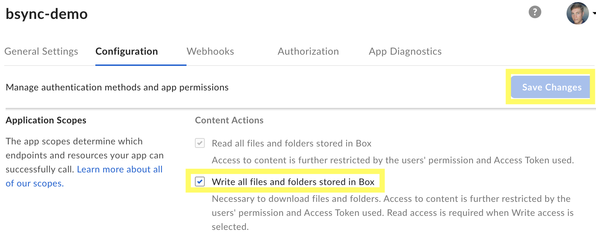
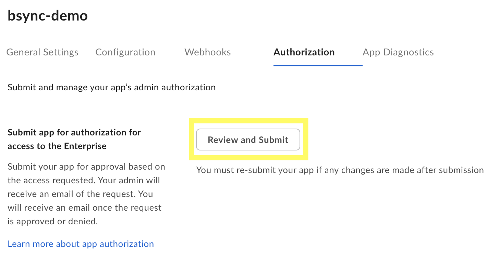
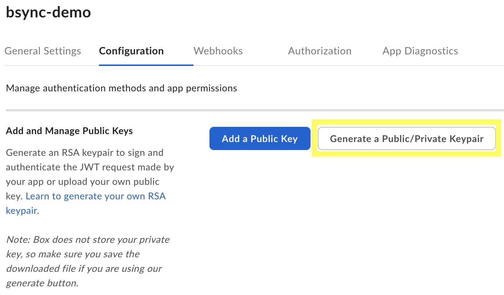
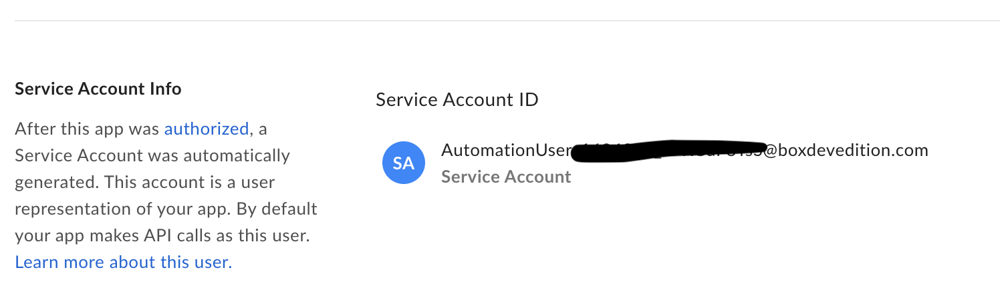
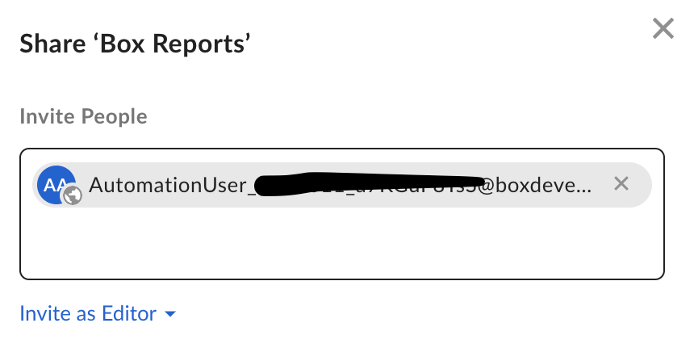

(App)=
# Creating a Box App for use with bsync

## Overview

You need to create a Box app with access to read/write your files/folders.
The app must have JWT server side auth enabled.
The JSON settings file with your keys will be required to run `bsync`
The whole process is also officially outlined by Box here

[https://github.com/box/developer.box.com/blob/main/content/guides/tooling/cli/quick-start/1-create-jwt-app.md](https://github.com/box/developer.box.com/blob/main/content/guides/tooling/cli/quick-start/1-create-jwt-app.md)

## Create New App

On your own Box.com instance, navigate `Dev Console > My Apps` and click `Create New App`

[https://app.box.com/developers/console](https://app.box.com/developers/console)

On the next page, use a `Custom App` with `Server Side Authentication (with JWT)`.
Give your app a name and click `Create App`

## Configure the App

In the `Configuration` section at the top, scroll down and add the `Write all files and folders stored in Box`. This is the only app permission that bsync requires.

Once you have checked the box, you can click `Save Changes` at the top to update your app's config.

## App Authorization

In the top menu, click on the `Authorization` tab. This section lets you submit your custom app to your Box administrators for approval. Your app must be approved before continuing with the setup. Click `Review and Submit` to publish your changes.

## Generate your App's Keys

Once your app has been approved by your administrators, go back to the `Configuration` tab in the top menu. Scroll down to the `Add and Manage Public Keys` section. Click the `Generate a Public/Private Keypair`. This will trigger a download of a JSON file from Box.com. KEEP THIS FILE PRIVATE! It contains your private key. You will use this file when running `bsync`

## Add Service Account to Folders

In order for you to be able to use your app to access any of your folders, Box.com uses service accounts attached to the app. Under your app's `General Settings` tab on the top left, scroll down to the `Service Account Info` and use the email address there to let your app collaborate with the folders you want to sync.

Now navigate to your target folders and add the service account by email to the folder as an `Editor`. Now your app has permissions to upload your files to the folder to which you have added your service account.

You have complete'd your app install, now you can `bsync`

Check out the  page to see how
