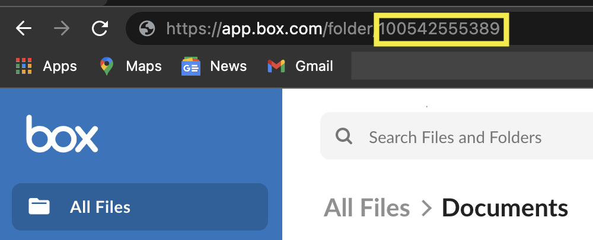

(Usage)=
# Usage

## Basic

The `bsync` command is installed as a script on your computer when `pip install bsync` is run.
On *nix systems it is simply `bsync` on Windoze it is `bsync.exe`

The full command reference help text can be found by running `bsync --help`

```
Usage: bsync [OPTIONS] SOURCE_FOLDER[:PATHS] BOX_FOLDER_ID
```

## Arguments

### `SOURCE_FOLDER`

Environment Variable: `SOURCE_FOLDER`

This is a folder that is on your local file system.
This is the directory that will be copied into your Box.com instance.
The directory file structure and subfolders will be preserved.
The source folder is mapped directly to the destination.
In rsync terms, think of bsync as doing a trailing slash.

You can pass additional `PATHS` after the source folder (separated by a colon)
to only sync paths in the source folder matching that glob expression

Example

`~/myfolder:*.json`

Will copy all JSON files in the `myfolder` folder in your home directory.


### `BOX_FOLDER_ID`

Environment Variable: `BOX_FOLDER_ID`

This is the long integer that Box.com uses as a unique ID for every folder.
It can be found in the URL of the directory you want to use




## Options


### `--settings` (required)

Environment Variable: `BOX_SETTINGS_FILE`

The source path to the JSON settings file for you Box app.

See the [](App) page if you havent already

### `--box-user`

Environment Variable: `BOX_USER`

The user who will own the files you upload.
This should be the user who created the app (unless you have the as-user feature enabled).
Defaults to current user

### `--output`

The file path to write a log of which files and folders were created.
Use this as an audit log as to what was done on Box.com

### `--log-flie`

The file path to write application logs (and errors if any).
Defaults to wrting to stderr

### `--log-level`

The Python logging level to use when writing application logs.
Defaults to `info`

### `--ipdb`

Drop into an `ipdb` shell on application errors

## Example

```
bsync --settings 12345.json --log-level DEBUG images:*.jpg 123456789
```

Uses the `12345.json` as the Box settings file.

Searches for all JPG images from `images` folder

Uploads files found to the Box.com folder with ID `123456789`

Logs application `DEBUG` messages to stderr
